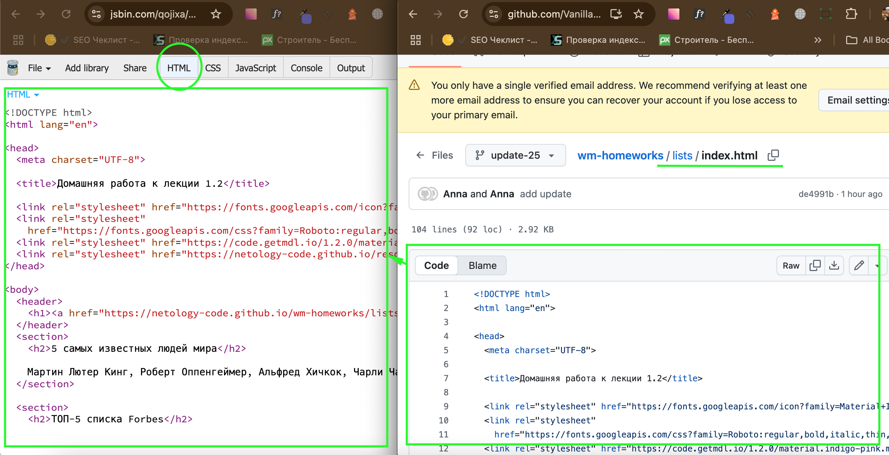

# Домашнее задание к лекции 1.2 «Списки и таблицы»

Вам предстоит поработать над созданием и систематизацией различных информационных блоков для внутреннего портала компании. Задачи включают в себя формирование списков, создание структурированных таблиц и исправление ошибок в уже существующих данных.

## Инструкция

1. Перечислены имена первых 5 самых известных людей мира. Сформируйте из них список.
Мартин Лютер Кинг, Роберт Оппенгеймер, Альфред Хичкок, Чарли Чаплин, Коко Шанель

2. Ниже написаны  имена  людей из ТОП-5 списка Forbes. В скобках даны данные о финансовом состоянии этих людей. Расположите их в порядке убывания денег.
Карлос Слим Элу ($50 млрд), Билл Гейтс ($75 млрд), Уоррен Баффет ($60,8 млрд), Джефф Безос ($45,2 млрд), Амансио Ортега ($67 млрд)

3. Намечается детский праздник и нужно составить смету на заказ аниматоров в костюмах сказочных персонажей. У всех колонок должны быть заголовки «Персонаж»/«Время выступления»/«Цена». В конце таблицы сделайте строку ИТОГО и посчитайте общие затраты на аниматоров. Строка «ИТОГО» должна занимать две ячейки, а сумма должны быть в третьем столбце.
  * Белоснежка/12.00/1 500 руб.
  * Лунтик/12.30/4 800 руб.
  * Маша и Медведь/13.15/8 400 руб.
  * Бэтмен/13.45/5 200 руб.
  * Джек Воробей/14.30/3 300 руб.
  * Аватар/14.50/4 000 руб.
  * Энгри Бердс/15.20/2 150 руб.
В таблице должны быть использованы все теги, изученные на занятии.


4. Кто-то составил таблицу с данными звезд эстрады для вашего сайта. Но допустил несколько грубых ошибок и таблица выглядит плохо.Найдите и устраните проблемы с лишними ячейками в таблице так, чтобы она перестала разваливаться. В итоге у вас должна получиться таблица из 7 строк и 4 колонок.


---
### Выполнение работы в CodePen
Перед выполнением работы прочитайте [инструкцию по работе с Codepen](https://github.com/netology-code/guides/blob/master/codepen/).
1. Перейдите по ссылке - [«Домашняя работа к лекции 1.2»](https://codepen.io/Netology/pen/LzowBy?editors=1000)
2. Нажмите кнопку Fork
3. Выполните домашнее задание
4. Нажмите кнопку Save

### Выполнение работы в JSBin
Перед выполнением работы прочитайте [инструкцию по работе с JSВin](https://github.com/netology-code/guides/tree/master/jsbin).
1. Создайте новый bin в своем аккаунте (процесс регистрации описан в инструкции)
2. Откройте index.html на гитхабе и скопируйте его содержание во вкладку html в своем bin

3. Создайте описание для bin и вставьте туда название задания - 1.2 «Списки и таблицы».Пример созданного мета тега -  ```<meta name="description" content="1.2 «Списки и таблицы»">)```
4. Выполните задание
5. Нажмите сохранить (file > save snapshot)


### Критерии проверки 
1. Для список использована конструкция списков ul>li

Плохо

```
<ul>
  <p>Мартин Лютер Кинг</p>
  <li><span>Роберт Оппенгеймер</span></li>
</ul>
```
Хорошо 
```
<ul>
  <li>Мартин Лютер Кинг</li>
  <li>Роберт Оппенгеймер</li>
</ul>
```
2. Для нумерных и ненумерных список используются подходящие теги (с номерами и без)
3. Отсуствуют пустые теги, например
```<td></td>```
4. Парные теги имеют закрывающийся тег
Плохо
```<td>Лев```
Хорошо 
```<td>Лев</td>```