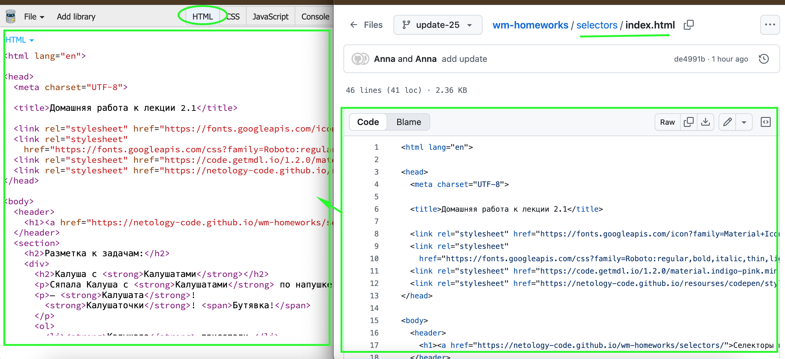

# Домашнее задание к лекции 2.1 «Селекторы и свойства»

Вам предстоит выступить в роли веб-дизайнера, которому поручено стилизовать отрывок из фантазийного произведения. Вы должны применить специфические правила CSS для различных элементов текста, добившись четкого визуального разделения и акцентирования ключевых слов, согласно техническому заданию.

## Инструкция

1. Измените цвет текста в заголовке второго уровня *Калуша с Калушатами* на синий (`blue`). При этом все остальные заголовки должны остаться без изменений.

2. Напишите правило, которое изменит цвет текста для всех выделенных тегом `strong` упоминаний *Калушат* на коричневый (`brown`) цвет.

3. Напишите правило для всех выделенных тегом span упоминаний *Бутявки*, находящихся внутри цитат (`blockquote`), измените цвет текста на желтый (`yellow`) и задайте полужирное начертание.

4. Напишите правило, согласно которому все выделенные тегом `strong` упоминания *Калушат* внутри списка `ol` имели бы курсивное начертание.


## Критерии проверки 
1. Использованы селекторы по тегу, например
```
p {
  color: red;
}
```
2. Допускается использование комбинированных селекторов, например
```
p span {
  color: red
}
```

---
### Выполнение работы в CodePen
Перед выполнением работы прочитайте [инструкцию по работе с Codepen](https://github.com/netology-code/guides/blob/master/codepen/).
1. Перейдите по ссылке - [«Домашняя работа к лекции 2.1»](https://codepen.io/Netology/pen/wrbVxQ?editors=1100)
2. Нажмите кнопку Fork
3. Выполните домашнее задание
4. Нажмите кнопку Save

### Выполнение работы в JSBin
Перед выполнением работы прочитайте [инструкцию по работе с JSВin](https://github.com/netology-code/guides/tree/master/jsbin).
1. Создайте новый bin в своем аккаунте (процесс регистрации описан в инструкции)
2. Откройте index.html на гитхабе и скопируйте его содержание во вкладку html в своем bin

3. Создайте описание для bin и вставьте туда название задания - 2.1 «Селекторы и свойства». Пример созданного мета тега -  ```<meta name="description" content="2.1 «Селекторы и свойства»">)```
4. Выполните задание
5. Нажмите сохранить (file > save snapshot)
