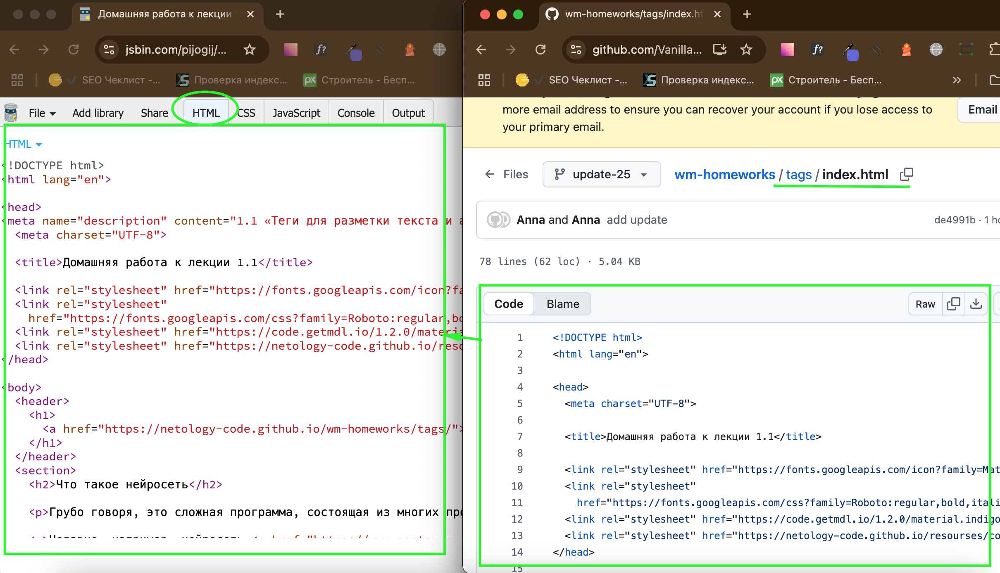

# Домашнее задание к лекции 1.1 «Теги для разметки текста и атрибуты»

Вы работете в местном новостном портале и перед вами стоит задача поработать над лентой с несколькими статьями. Вам нужно правильно разметить предоставленный текст, используя семантические теги HTML5, а также исправить уже существующие ошибки в разметке, чтобы страница была корректной, доступной и хорошо структурированной.

## Инструкция
1. Разметить текст в первом теге `section`. Предложение *Что такое нейросеть* сделать заголовком второго уровня. Под ним должно получиться два абзаца текста.

2. Во втором абзаце в предложении *Недавно, например, нейросеть научилась писать песни в стиле Егора Летова* поставить ссылку на слове научилась на страницу [https://www.sostav.ru/publication/nejroset-yandeksa-napisala-tekst-dlya-muzykalnogo-alboma-22860.html](https://www.sostav.ru/publication/nejroset-yandeksa-napisala-tekst-dlya-muzykalnogo-alboma-22860.html)

3. Исправить разметку во втором теге `section`, так, чтобы фраза *Дорога* стала заголовком второго уровня. После которого идет абзац текста, цитата с одним абзацем текста, и еще один абзац.

4. Разметить текст в третьем теге `section` с заголовком *Источники и гейзеры Камчатки*. Названия гейзеров и источников сделать заголовком `h3`, описание абзацем. Перед описанием каждого гейзера вставить его фотографию:
    * *Поселок малки* — [https://netology-code.github.io/wm-homeworks/img/malki.jpg](https://netology-code.github.io/wm-homeworks/img/malki.jpg)
    * *Налычевская долина* — [https://netology-code.github.io/wm-homeworks/img/nalichevo.jpg](https://netology-code.github.io/wm-homeworks/img/nalichevo.jpg)
    * *Паратунка* — [https://netology-code.github.io/wm-homeworks/img/paratunka.jpg](https://netology-code.github.io/wm-homeworks/img/paratunka.jpg)
    
5. Добавьте название гейзера в качестве альтернативного текста для фотографии.


---
### Выполнение работы в CodePen
Перед выполнением работы прочитайте [инструкцию по работе с Codepen](https://github.com/netology-code/guides/blob/master/codepen/).
1. Перейдите по ссылке - [«Домашняя работа к лекции 1.1»](https://codepen.io/Netology/pen/aLrejm?editors=1000)
2. Нажмите кнопку Fork
3. Выполните домашнее задание
4. Нажмите кнопку Save

### Выполнение работы в JSBin
Перед выполнением работы прочитайте [инструкцию по работе с JSВin](https://github.com/netology-code/guides/tree/master/jsbin).
1. Создайте новый bin в своем аккаунте (процесс регистрации описан в инструкции)
2. Откройте index.html на гитхабе и скопируйте его содержание во вкладку html в своем bin

3. Создайте описание для bin и вставьте туда название задания - 1.1 «Теги для разметки текста и атрибуты». Пример созданного мета тега -  ```<meta name="description" content="1.1 «Теги для разметки текста и атрибуты»">)```
4. Выполните задание
5. Нажмите сохранить (file > save snapshot)


### Критерии для самопроверки
Прежде чем отправить задание, проверьте себя по чек-листу. Он поможет вам убедиться, что все шаги выполнены корректно, и вы ничего не упустили.
1. Все текстовые сущности имеют текстовые теги.

Плохо

```Дорога```

Хорошо 

```<h2>Дорога</h2>```

2. Ссылки работают и по ним можно перейти.
3. Отсуствуют пустые теги, например
```<p></p>```.
4. Картинки отображаются.
5. Парные теги имеют закрывающийся тег.

Плохо

```<h2>Дорога```

Хорошо 

```<h2>Дорога</h2>```
