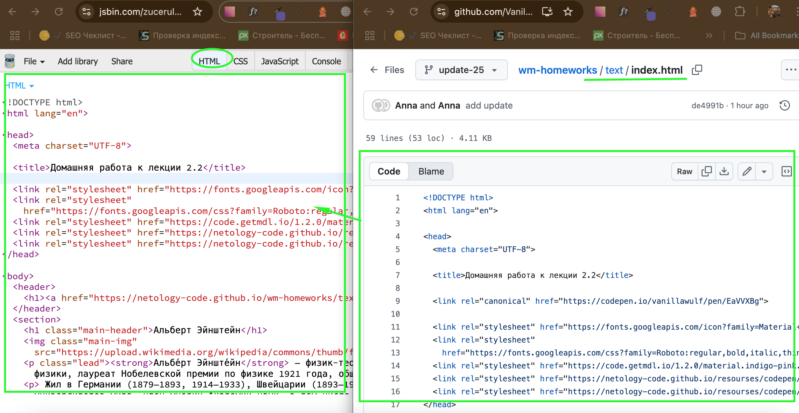

# Домашнее задание к лекции 2.2 «Оформление текстовых блоков при помощи CSS»

Ваш друг решил сделать свою энциколпедию и попросил помощи при работе над заготовкой веб-страницы. Ваша основная задача — оформить предоставленный HTML-код с помощью CSS, придав ему современный, читаемый и структурированный вид.

## Инструкция
1. Для заголовка с классом `main-header` установить размер шрифта `56px` и цвет `#365f91`

2. Также поменять семейство шрифта на *serif* (с засечками)

3. Текст во всех абзацах должен иметь размер `20px`

4. У текста внутри тега `strong` в абзаце с классом `lead` задайте нижнее подчеркивание

5. Задать тексту списка цвет `#365f91.

6. Установить для пунктов списка первого уровня в качестве маркера - квадрат (■), а для пунктов списка второго уровня - пустой круг (○).

7. Для фона цитаты установите картинку, которая находится по адресу: [https://netology-code.github.io/wm-homeworks/text/images/wm-2-2-bg.jpg](https://netology-code.github.io/wm-homeworks/text/images/wm-2-2-bg.jpg)

8. Цвет текста цитаты установить в `#494429`

9. Изменить начертание на курсивное и поменять семейство шрифта на *serif* (с засечками).

---
### Выполнение работы в CodePen
Перед выполнением работы прочитайте [инструкцию по работе с Codepen](https://github.com/netology-code/guides/blob/master/codepen).
1. Перейдите по ссылке - [«Домашняя работа к лекции 2.2»](https://codepen.io/Netology/pen/oGRKPw)
2. Нажмите кнопку Fork
3. Выполните домашнее задание
4. Нажмите кнопку Save


### Выполнение работы в JSBin
Перед выполнением работы прочитайте [инструкцию по работе с JSВin](https://github.com/netology-code/guides/tree/master/jsbin).
1. Создайте новый bin в своем аккаунте (процесс регистрации описан в инструкции)
2. Откройте index.html на гитхабе и скопируйте его содержание во вкладку html в своем bin

3. Создайте описание для bin и вставьте туда название задания - «Домашняя работа к лекции 2.2». Пример созданного мета тега -  ```<meta name="description" content="«Домашняя работа к лекции 2.2»">)```
4. Выполните задание
5. Нажмите сохранить (file > save snapshot)